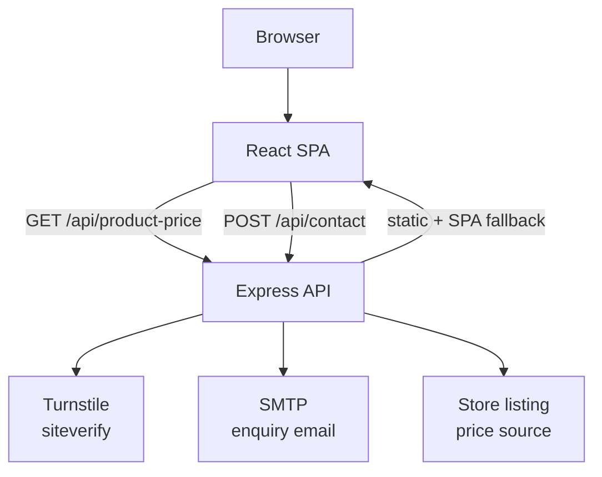

# Gents Facial Club

Official website for Gents Facial Club — a members' facial clinic in Al Bateen, Abu Dhabi. A React single-page application with an Express API that handles membership enquiries and keeps membership pricing in sync with the clinic's store.

| | |
| --- | --- |
| **Production Website** | https://gentsfacialclub.com/ |
| **Frontend** | React 19 · TypeScript 6 · Vite 8 |
| **Backend** | Node.js · Express 5 |
| **Deployment** | Railway (`railway.toml`) |
| **Status** | Production |

---

## Overview

Gents Facial Club sells annual memberships for clinical facial treatments. The website presents the club, its treatment programmes, and its two membership plans, then routes interested visitors to either the external store or the enquiry form.

The primary user journey:

1. A visitor lands on the home page and reads about the club and its treatments.
2. They compare the two membership plans — **For Adults** and **For Students** — each with its own page and current price.
3. They either purchase directly through the external Everlast Wellness store, or submit an enquiry through the contact form.
4. Submitted enquiries are validated server-side and emailed to the clinic over SMTP.

Membership prices are not hardcoded. The server scrapes them from the club's public store listing and serves them to the frontend, so the site reflects the live price without a redeploy.

The full interface is available in five languages, with right-to-left layout for Arabic.

---

## Features

- **Five-language interface** — English, Arabic, Russian, Hindi, Chinese
- **Arabic RTL support** — document direction and typeface switch with the language
- **Membership pages** — dedicated pages for the Adults and Students plans
- **Live membership pricing** — fetched from the store rather than hardcoded
- **Enquiry form** — country-code phone input, inline field validation, success and error states
- **Server-side validation** — the API re-validates every submission independently of the client
- **Cloudflare Turnstile** — CAPTCHA verified server-side before any email is sent
- **SMTP email delivery** — formatted HTML enquiry emails via Nodemailer
- **HTML escaping** — all user input escaped before interpolation into email markup
- **Responsive design** — desktop-first cascade with overrides down to 360px
- **WebGL smoke animation** — animated background on the home hero and mobile menu
- **Animated mobile navigation** — full-screen GSAP-driven menu
- **Client-side routing** — History API navigation with server-side deep-link support

---

## Pages

| Path | Page | Purpose |
| --- | --- | --- |
| `/` | `HomePage` | Club introduction, treatments, membership overview, testimonials |
| `/about` | `AboutPage` | About the club, its philosophy and facilities |
| `/for-adults` | `ForAdultsPage` | Adults membership plan, services, add-ons and pricing |
| `/for-students` | `ForStudentsPage` | Students membership plan, services, add-ons and pricing |
| `/contact` | `ContactPage` | Enquiry form and clinic contact details |

Unrecognised paths fall back to the home page.

### Language-prefixed paths

Non-English languages carry a prefix: `ar`, `ru`, `hi`, `zh`. English is unprefixed.

```
/about        →  English
/ar/about     →  Arabic
/zh/          →  Chinese home page
```

The router strips the prefix before resolving the route, so `/about` and `/ar/about` render the same page in different languages. Switching language rewrites the current URL in place without a navigation.

---

## Technologies Used

| Layer | Technology |
| --- | --- |
| Frontend framework | React 19 |
| Language | TypeScript 6 |
| Build tool | Vite 8 |
| Styling | Plain CSS with custom properties |
| Routing | Custom router (History API, React Context) |
| Internationalization | Custom translation modules (React Context) |
| Animation | GSAP · WebGL2 (hand-written GLSL) |
| Backend | Node.js · Express 5 |
| Email | Nodemailer (SMTP) |
| CAPTCHA | Cloudflare Turnstile |
| Linting | ESLint 10 · typescript-eslint |
| Deployment | Railway |

Fonts are loaded from Google Fonts: Cormorant Garamond (display), Inter (body), DM Mono (labels), and Zain (Arabic).

---

## Architecture

The frontend is a single-page React application. The Express server does three things: exposes a small JSON API, keeps a cached copy of the current membership prices, and serves the built frontend with a catch-all fallback so deep links work on refresh.



**Contact form flow.** The client collects the form fields plus a Turnstile token and posts them to `/api/contact`. The server verifies the CAPTCHA first, then re-validates the fields, then checks that email credentials are configured, and only then sends the message. Each stage returns a specific error, so a rejected submission never reaches the mail transport.

**Pricing flow.** On startup the server fetches the club's public store page, extracts the price figures from the WooCommerce markup, and holds them in memory. It refreshes weekly. The client hook caches the response for five minutes and retries every three seconds while the server cache is still cold, so a page loaded during startup fills in without a manual refresh.

**Routing.** Navigation is handled in-process by a Context-based router using `history.pushState`; the server's catch-all route returns `index.html` for any unmatched path so refreshes and shared links resolve correctly.

**Translations.** Language state lives in a React Context that also sets `lang` and `dir` on the document element. Each locale is a separate module, all typed against the English source.

In development, Vite proxies `/api` to the Express server on port 3001, so both run from a single command against one origin.

---

## Localization / Languages

**Supported languages:** English (default), Arabic, Russian, Hindi, Chinese.

Each locale is a module under `src/i18n/locales/`, registered in `src/i18n/index.ts`. The `Translations` type is derived from the English locale, so all five stay structurally identical — adding a key to `en.ts` makes it required everywhere else at compile time.

`LanguageContext` holds the active language, exposes the resolved translation object as `t`, and writes `lang` and `dir` onto `<html>` on every change. The selected language persists in `localStorage` and is also inferred from the URL prefix on first load.

**Arabic RTL.** Selecting Arabic sets `dir="rtl"`, which activates the rules in `src/styles/rtl.css` and swaps the body and display typefaces to Zain. Layout mirroring is handled in that file; component code stays direction-agnostic.

---

## Project Structure

```
├── index.html                 # App shell: fonts, favicon, Turnstile script
├── railway.toml               # Deployment configuration
├── vite.config.ts             # Build config + dev /api proxy
│
├── public/                    # Served verbatim at the web root
│
├── server/
│   ├── package.json           # Server runtime dependencies
│   ├── server.js              # Entry point: middleware, routes, static serving
│   └── src/
│       ├── routes/            # contact · productPrice · health
│       ├── services/          # mailer · priceScraper · turnstile
│       └── utils/             # validate · escapeHtml
│
└── src/
    ├── main.tsx               # React entry point
    ├── App.tsx                # Providers + route-to-page mapping
    ├── router/                # History API router and Route type
    ├── context/               # LanguageContext (language, translations, direction)
    ├── hooks/                 # useProductPrice
    ├── i18n/
    │   ├── index.ts           # Locale registry and shared types
    │   └── locales/           # en · ar · ru · hi · zh
    ├── pages/                 # One component per route
    ├── components/
    │   ├── layout/            # Nav · MobileMenu · Footer
    │   └── ui/                # Marquee · SmokeBackground
    ├── styles/                # CSS files, imported through index.css
    └── assets/imgs/           # Bundled imagery
```

Two directories are worth understanding before making changes:

**`src/styles/`** — `index.css` is an import manifest, not a stylesheet. Import order is cascade order, so moving an `@import` can change which rules win. Add new rules inside the relevant file rather than in the manifest.

**`src/i18n/locales/`** — `en.ts` is the source of truth. Every other locale is typed against it, so a missing or misspelled key fails the type check rather than rendering blank.

---

## API

All endpoints return JSON. In development, requests to `/api` are proxied to the Express server.

### POST `/api/contact`

Submits a membership enquiry.

**Request body**

```json
{
  "name": "Full name",
  "phone": "+971 500000000",
  "email": "person@example.com",
  "message": "Enquiry text",
  "turnstileToken": "<token from the Turnstile widget>"
}
```

**Responses**

```json
{ "success": true }
```

```json
{ "success": false, "error": "Valid email is required." }
```

**Validation** — applied server-side, independently of the client. Name at least 2 characters; phone at least 5; email matched against a format pattern; message at least 3 characters. The first failing rule is returned.

**Security** — the Turnstile token is verified against Cloudflare before validation runs, so an unverified request never reaches the mail transport. All fields are HTML-escaped before being interpolated into the email body. If email credentials are missing or still placeholders, the endpoint returns a descriptive `500` instead of attempting delivery.

**Status codes** — `200` on success; `400` for a missing or rejected CAPTCHA and for validation failures; `500` for CAPTCHA verification failure, unconfigured credentials, or an SMTP error.

### GET `/api/product-price`

Returns the current membership prices as formatted strings, exactly as parsed from the store.

```json
{ "adults": "3.999", "students": "3.499" }
```

**Caching** — the server fetches prices once at startup and refreshes weekly, holding them in memory. Before the first fetch resolves, both fields are `null`; the client hook retries until real values arrive, then caches them for five minutes.

**Source** — the club's public product listing on the Everlast Wellness store. Prices are parsed from the WooCommerce price markup, with the highest figure taken as the Adults plan and the lowest as Students.

### GET `/api/health`

Liveness check.

```json
{ "status": "ok", "time": "2026-01-01T00:00:00.000Z" }
```

---

## Environment Variables

No secret values belong in the repository. Client variables are compiled into the bundle and are publicly visible; server variables stay on the server.

### Client

Read by Vite from `.env.local`. Must be prefixed `VITE_` to be exposed.

| Variable | Required | Purpose |
| --- | --- | --- |
| `VITE_TURNSTILE_SITE_KEY` | Recommended | Cloudflare Turnstile **site** key. Safe to expose — it is a public key by design. Without it the CAPTCHA widget does not render and the form cannot be submitted successfully. |

### Server

Read by `dotenv` from `server/.env`. None are safe to expose to the client.

| Variable | Required | Purpose |
| --- | --- | --- |
| `EMAIL_HOST` | Yes | SMTP server hostname |
| `EMAIL_USER` | Yes | SMTP username; also the `From` address |
| `EMAIL_PASS` | Yes | SMTP password |
| `EMAIL_TO` | Yes | Recipient address for enquiries |
| `EMAIL_PORT` | No | SMTP port. Defaults to `587` |
| `EMAIL_SECURE` | No | Set to `true` for implicit TLS. Defaults to `false` |
| `TURNSTILE_SECRET_KEY` | Yes | Cloudflare Turnstile **secret** key, used for server-side verification |
| `PORT` | No | HTTP port. Defaults to `3001` |
| `CLIENT_ORIGIN` | Yes in production | Public site origin — set to `https://gentsfacialclub.com` in the production environment. Added to the CORS allowlist and used to build the absolute logo URL in enquiry emails. Falls back to `http://localhost:5173` for CORS, so configure it explicitly rather than relying on the default |

The four email variables marked required above are checked at startup. If any is missing — or still holds a placeholder beginning with `your-` — the server logs a warning and the contact endpoint returns a descriptive error rather than failing silently.

---

## Getting Started

**Prerequisites:** Node.js with npm. The build targets a current TypeScript and Express 5, so a current LTS release is expected.

**1. Clone and install**

Dependencies live in two manifests — the root for the frontend, `server/` for the API.

```bash
git clone <repository-url>
cd Gents-Club
npm install
npm install --prefix server
```

**2. Configure environment variables**

Create `.env.local` in the project root:

```bash
VITE_TURNSTILE_SITE_KEY=your-turnstile-site-key
```

Create `server/.env`:

```bash
EMAIL_HOST=smtp.example.com
EMAIL_PORT=587
EMAIL_SECURE=false
EMAIL_USER=your-smtp-user
EMAIL_PASS=your-smtp-password
EMAIL_TO=recipient@example.com
TURNSTILE_SECRET_KEY=your-turnstile-secret-key
PORT=3001
```

Both files are gitignored. The site runs without them, but the contact form will not deliver mail.

**3. Start the development servers**

```bash
npm run dev
```

This runs Vite and the Express server together. Vite prints the client URL — `http://localhost:5173` unless the port is taken — and proxies `/api` to the server on port 3001. To run them separately, use `npm run dev:client` and `npm run dev:server`.

**4. Verify the setup**

The Express server logs SMTP connectivity and the scraped prices at startup. Confirm the API directly with:

```bash
curl http://localhost:3001/api/health
```

---

## Development Commands

Root `package.json`:

| Command | Description |
| --- | --- |
| `npm run dev` | Run the Vite dev server and the Express server together |
| `npm run dev:client` | Run the Vite dev server only |
| `npm run dev:server` | Run the Express server only, with file watching |
| `npm run build` | Type-check the project, then build to `dist/` |
| `npm run preview` | Serve the production build locally |
| `npm run lint` | Run ESLint across the repository |
| `npm start` | Start the Express server, serving `dist/` |

`server/package.json` provides `npm start` for running the API on its own from within `server/`.

Type checking runs as part of `npm run build`. To check types without building, run `npx tsc -b`.

---

## Production / Deployment

Deployment is configured for Railway in `railway.toml`.

```toml
[build]
installCommand = "npm ci && npm ci --prefix server"
buildCommand = "npm run build"

[deploy]
startCommand = "npm run start"
```

**Install.** Both manifests are installed. The server's runtime dependencies are declared in the root `package.json`, so a root install is sufficient for `npm start`; installing `server/` as well keeps the standalone API path working.

**Build.** `npm run build` type-checks and emits the static frontend to `dist/`.

**Start.** `npm start` launches the Express server, which serves `dist/` as static files and mounts the API under `/api`.

**SPA fallback.** A catch-all route returns `index.html` for any path the static handler does not match, so `/for-adults`, `/ar/about`, and every other deep link resolve on direct load and refresh. The catch-all is registered after the API routes so it never shadows them. It uses Express 5 path syntax (`/{*path}`) — running the server against Express 4 would break every deep link.

**Required configuration.** Set the server variables from the table above in the deployment environment. Set `CLIENT_ORIGIN` explicitly to `https://gentsfacialclub.com` on Railway: it places the production origin on the CORS allowlist so the site's own API requests are accepted, and it resolves the absolute logo URL embedded in enquiry emails. Left unset, the CORS entry falls back to a localhost origin. `VITE_TURNSTILE_SITE_KEY` must be present at build time, since Vite inlines it into the bundle. Register the production domain with Cloudflare Turnstile, or the widget will refuse to render.

---

## Security

Mechanisms implemented in this codebase:

- **Secrets in environment variables** — no credentials in the repository; `.env` files are gitignored
- **SMTP credentials server-side only** — the mail transport is never reachable from the browser
- **Cloudflare Turnstile** — tokens verified server-side against Cloudflare before any other processing
- **Server-side validation** — the API validates every submission independently; client-side checks are a convenience, not the boundary
- **HTML escaping** — all user-supplied fields escaped before interpolation into email markup
- **CORS allowlist** — restricted to the configured client origin and the local preview port, limited to `GET` and `POST`
- **Startup credential check** — placeholder or missing email configuration is detected at boot and surfaced as a clear API error

For clarity, the following are **not** implemented: authentication, authorization, rate limiting, and CSRF protection. The site has no user accounts, sessions, or authenticated areas, so there is nothing for an authentication or authorization layer to guard, and no session state for CSRF tokens to protect. The Turnstile check is the only abuse control on the contact endpoint.

---

## Performance & UX

- **Two-tier price caching** — the server holds prices in memory and refreshes weekly rather than per request; the client caches the result at module scope for five minutes, so navigating between pages does not refetch
- **Cold-start recovery** — the price hook retries while the server cache is still filling, so an early page load resolves without user action
- **Transform-only animations** — the marquee and mobile menu animate transform and opacity, staying off the layout path
- **Reduced-motion support** — the marquee stops for visitors who prefer reduced motion
- **WebGL lifecycle management** — the mobile menu's shader is mounted only while the menu is open and torn down afterwards, releasing the GL context
- **Responsive imagery** — WebP for photography, constrained by CSS rather than fixed dimensions
- **Font preconnect** — Google Fonts origins preconnected in the document head, with `display=swap`

---

## Design System

Design tokens live in `src/styles/tokens.css` as CSS custom properties on `:root`. They cover the palette, the type stacks, a `--sp-1` through `--sp-10` spacing scale, and layout values including `--gutter`, `--max-w`, and `--nav-h`. Prefer a token over a literal value.

**Palette.** The current theme is a blue scheme built on `--ivory`, `--bone`, `--ink`, `--taupe`, `--oxblood`, and `--gold`. Note that several token *names* predate the current brand and no longer describe their values — `--gold` and `--oxblood` both hold blue tones. Treat the token name as an identifier for its role in the design, not as a colour description.

**Typography** — Cormorant Garamond for display headings, Inter for body copy, DM Mono for uppercase labels and eyebrows, Zain for Arabic.

**Responsive approach** — a desktop-first cascade. The main shared breakpoints are grouped in `src/styles/responsive.css` and `src/styles/responsive-mid.css`, with additional component-specific breakpoints in individual stylesheets; the mobile navigation breakpoint is 768px.

**RTL** — direction-specific rules are isolated in `src/styles/rtl.css`, scoped under `:root[dir="rtl"]`. Use logical properties such as `padding-inline` in new rules so they work in both directions without a second selector.

---

## Maintenance Notes

| Task | Where |
| --- | --- |
| Add a page | Create it in `src/pages/`, add the slug to `Route` and `VALID_ROUTES` in `src/router/index.tsx`, then map it in the `pages` object in `src/App.tsx` |
| Add a navigation link | `src/components/layout/Nav.tsx` (desktop and mobile link arrays) |
| Add a reusable component | `src/components/ui/` for presentational pieces, `src/components/layout/` for page furniture |
| Add or change a translation | Add the key to `src/i18n/locales/en.ts` first — the type check will then require it in the other four locales |
| Add a language | Create the locale module, register it in `src/i18n/index.ts`, and add the prefix to `LANG_PREFIXES` in `src/router/index.tsx` and the language list in `Nav.tsx` |
| Add an API endpoint | Create a router in `server/src/routes/`, put the logic in `server/src/services/`, then mount it in `server/server.js` before the SPA catch-all |
| Change the tracked product or pricing logic | `server/src/services/priceScraper.js` for the product URL, parsing and caching; `src/hooks/useProductPrice.ts` for client-side behaviour |
| Change email content | `server/src/services/mailer.js` |
| Add styles | The matching file in `src/styles/components/` or `src/styles/pages/`, never the `index.css` manifest |

A note on the price scraper: it parses third-party HTML and will need attention if the store's markup changes. It fails safely — parse failures leave the cache untouched and log a warning rather than throwing.

---

## Troubleshooting

**`[Cloudflare Turnstile] Error: 110200` in the console on localhost**
The domain is not registered with Turnstile. Expected during local development; add `localhost` to the Turnstile widget's allowed hostnames to render the widget locally.

**Contact form reports the server is not configured**
One or more of `EMAIL_HOST`, `EMAIL_USER`, `EMAIL_PASS`, `EMAIL_TO` is missing or still a `your-` placeholder. The response names the missing variables, and the server logs the same warning at startup.

**Prices show as empty or fall back to placeholder text**
The server cache had not filled when the page loaded. The client retries automatically. If prices never arrive, check the server log for `[price]` entries — a parse failure there means the store's markup has changed.

**API requests 404 or fail in development**
The Express server is not running. `npm run dev:client` alone starts only Vite; use `npm run dev` to run both, or start the server separately with `npm run dev:server`.

**Deep links 404 in production**
The SPA fallback is not being reached. Confirm the server is serving `dist/` (run `npm run build` first) and that the Express 5 catch-all is intact.

**Vite starts on an unexpected port**
Port 5173 was already in use and Vite selected the next free port. The `/api` proxy still works; note that CORS allows only the configured `CLIENT_ORIGIN` and `http://localhost:4173`.

---

## License

No license is currently specified for this repository. All rights reserved by the project owner.
